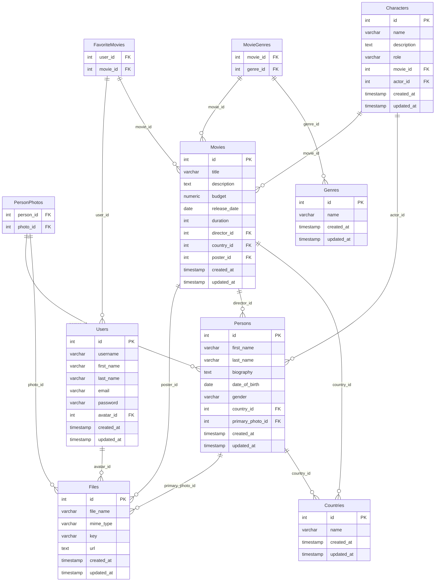

# ER Diagram

```mermaid
erDiagram
    Files {
        int id PK
        varchar file_name
        varchar mime_type
        varchar key
        text url
        timestamp created_at
        timestamp updated_at
    }

    Users {
        int id PK
        varchar username
        varchar first_name
        varchar last_name
        varchar email
        varchar password
        int avatar_id FK
        timestamp created_at
        timestamp updated_at
    }

    Countries {
        int id PK
        varchar name
        timestamp created_at
        timestamp updated_at
    }

    Persons {
        int id PK
        varchar first_name
        varchar last_name
        text biography
        date date_of_birth
        varchar gender
        int country_id FK
        int primary_photo_id FK
        timestamp created_at
        timestamp updated_at
    }

    PersonPhotos {
        int person_id FK
        int photo_id FK
    }

    Movies {
        int id PK
        varchar title
        text description
        numeric budget
        date release_date
        int duration
        int director_id FK
        int country_id FK
        int poster_id FK
        timestamp created_at
        timestamp updated_at
    }

    FavoriteMovies {
        int user_id FK
        int movie_id FK
    }

    Genres {
        int id PK
        varchar name
        timestamp created_at
        timestamp updated_at
    }

    MovieGenres {
        int movie_id FK
        int genre_id FK
    }

    Characters {
        int id PK
        varchar name
        text description
        varchar role
        int movie_id FK
        int actor_id FK
        timestamp created_at
        timestamp updated_at
    }

    Users ||--o{ Files : "avatar_id"
    Persons ||--o{ Files : "primary_photo_id"
    Persons ||--o{ Countries : "country_id"
    PersonPhotos ||--o{ Persons : "person_id"
    PersonPhotos ||--o{ Files : "photo_id"
    Movies ||--o{ Files : "poster_id"
    Movies ||--o{ Persons : "director_id"
    Movies ||--o{ Countries : "country_id"
    FavoriteMovies ||--o{ Users : "user_id"
    FavoriteMovies ||--o{ Movies : "movie_id"
    MovieGenres ||--o{ Movies : "movie_id"
    MovieGenres ||--o{ Genres : "genre_id"
    Characters ||--o{ Movies : "movie_id"
    Characters ||--o{ Persons : "actor_id"
```